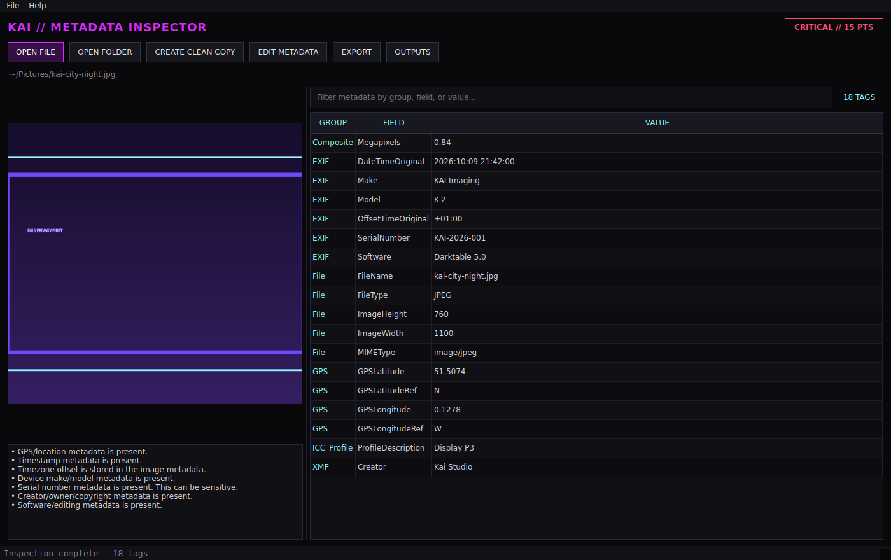

# Kai Metadata Inspector 2.0

Kai Metadata Inspector is an offline desktop application for finding, understanding, exporting, editing, and removing image metadata before a file is shared.

Version 2.0 replaces the Linux-alpha internals with one ExifTool-backed inspection engine and reproducible builds for Windows, macOS, and Linux.



## What it does

- Inspects EXIF, IPTC, XMP, ICC, maker notes, and container metadata locally
- Highlights GPS, timestamps, device identity, ownership, and editing history
- Assigns a transparent privacy-risk score with human-readable reasons
- Searches all metadata by group, field, or value
- Previews common images, including HEIC/HEIF when supported
- Scans folders in a background worker with visible progress and cooperative cancellation
- Exports full TXT reports, raw JSON, and folder CSV summaries
- Creates a cleaned copy, verifies the original SHA-256 hash, and shows a before/after tag comparison
- Edits selected fields only after creating a recovery backup
- Uses no telemetry, analytics, cloud services, or automatic network requests

## Platforms

| Platform | Build target | Status |
|---|---|---|
| Windows | Windows 10/11 x64 | Automated native preview build |
| macOS | Apple Silicon | Automated native preview build |
| macOS | Intel | Automated native preview build |
| Linux | x86_64 AppImage | Automated portable preview build |
| Linux | Python 3.11+ | Supported source install |

The release artifacts are currently unsigned. Windows Smart App Control/SmartScreen and macOS Gatekeeper may warn until release signing and Apple notarization credentials are configured.

## Run from source

Install ExifTool and Python 3.11 or newer, then:

```bash
python -m venv .venv
source .venv/bin/activate       # Windows: .venv\Scripts\activate
python -m pip install -r requirements.txt
python app.py
```

Linux packages:

```bash
sudo apt update
sudo apt install -y libimage-exiftool-perl libxcb-cursor0
```

macOS users can install ExifTool with `brew install exiftool`. Windows source users can place `exiftool.exe` on `PATH` or set `KAI_EXIFTOOL` to its full path. Native release artifacts include ExifTool.

## Diagnostics

```bash
python app.py --diagnostics
python app.py --version
```

Diagnostics show exactly which ExifTool executable is used and its version.

## Safety model

- Inspection is read-only.
- Cleaning copies bytes to a new destination, removes metadata from the copy only, and compares the original hash before and after.
- Editing changes the selected file, but first stores a timestamped recovery copy in the app data directory.
- ExifTool is always called with an argument list, never through a shell.
- Exported reports can themselves contain private metadata. Review them before sharing.

No metadata tool can promise removal of every proprietary field from every format. Re-open and inspect the cleaned output before publishing it.

## Output locations

- Linux: `~/.local/share/kai-metadata-inspector/`
- macOS: `~/Library/Application Support/Kai Metadata Inspector/`
- Windows: `%LOCALAPPDATA%\Kai Metadata Inspector\`

Set `KAI_METADATA_HOME` to use another location.

## Development

```bash
python -m pip install -r requirements-dev.txt
python -m ruff check .
QT_QPA_PLATFORM=offscreen python -m pytest -q
python -m PyInstaller --clean --noconfirm packaging/kai_metadata_inspector.spec
APPIMAGETOOL=/path/to/appimagetool packaging/linux/build_appimage.sh  # Linux x86_64
```

The CI pipeline repeats lint, tests, diagnostics, native packaging, and packaged-app smoke tests. See the [testing guide](docs/TESTING.md), [2.0 release checklist](docs/RELEASE_CHECKLIST.md), and [1.0 audit/design record](docs/V2_AUDIT.md).

## License

MIT. ExifTool is distributed under its own Perl Artistic License/GPL terms.
